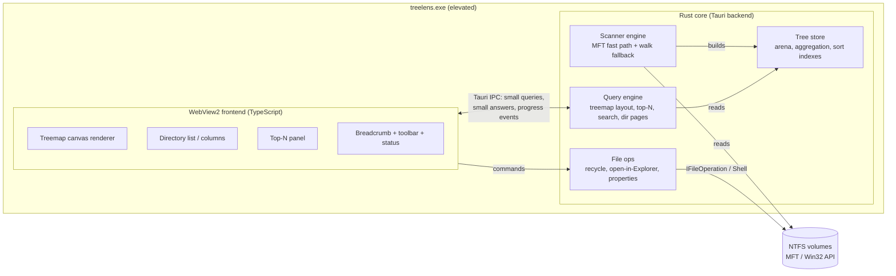
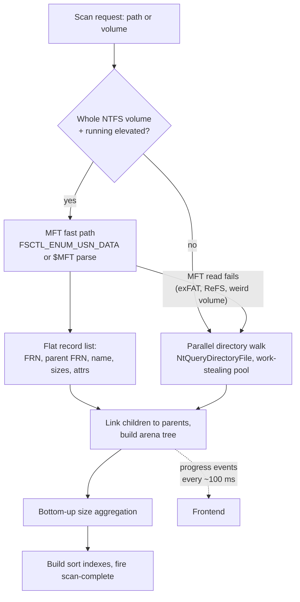
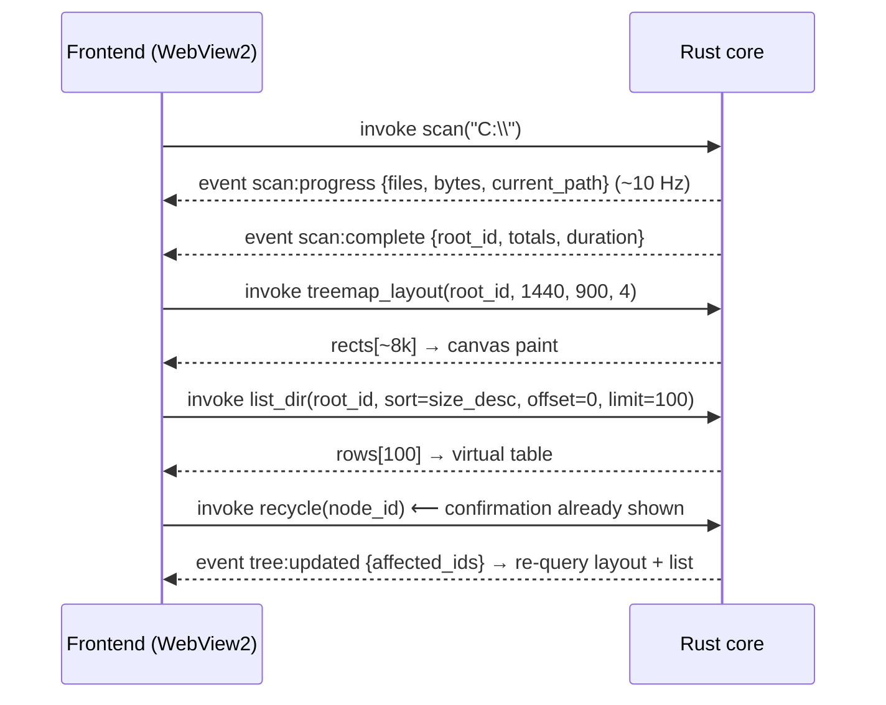

# Treelens — Project Plan

> **Status:** Planning phase. No application code exists yet. This document is the spec the
> implementation agent (Opus) will build from, after Skylar signs off on the open questions
> at the bottom.
>
> **One-liner:** A free, open-source, portable Windows disk-space visualizer — the spiritual
> successor to commercial disk-space tools, with MFT-native scan speed and a modern treemap UI.

---

## Table of contents

1. [Problem + goals](#1-problem--goals)
2. [Tech stack recommendation](#2-tech-stack-recommendation)
3. [Architecture sketch](#3-architecture-sketch)
4. [v1 feature scope](#4-v1-feature-scope)
5. [UAC / admin elevation](#5-uac--admin-elevation)
6. [Performance targets](#6-performance-targets)
7. [Build + release](#7-build--release)
8. [Repo conventions](#8-repo-conventions)
9. [Naming](#9-naming)
10. [Implementation phasing for the Opus agent](#10-implementation-phasing-for-the-opus-agent)
11. [Open questions for Skylar](#11-open-questions-for-skylar)

---

## 1. Problem + goals

### The problem

Skylar used the canonical desktop disk-space tools to answer the eternal question — *"what is eating my disk?"* — and
JAM Software moved it behind a paywall. The remaining free options each miss:

- **Older treemap tools** — beloved visualizations, but single-threaded scanners from the early 2000s. A full scan of a
  modern multi-terabyte volume takes many minutes, and the UI is dated Win32.
- **Closed-source MFT readers** — astonishingly fast (read the NTFS MFT directly), but closed-source, free
  only for personal use, and the UI is functional rather than pleasant.
- **Several other community tools** — abandoned or near-abandoned.

There is a genuinely open hole in the market: **fast as the MFT-readers, visual as the treemap classics,
organized like the columnar list-first tools, free forever, open source.**

### Goals

1. **Portable-first.** The primary artifact is a single `.exe` you download and double-click.
   No installer required, no runtime to install, nothing written outside its own folder
   unless the user asks. An optional installer exists for people who want Start-menu/
   file-association convenience, but it is secondary.
2. **Full file-system access.** The app runs elevated (admin) so it can see everything:
   `System Volume Information`, other users' profiles, ACL-restricted corners, and — the
   real prize — the raw NTFS MFT, which is what makes single-digit-second scans of multi-million-file volumes possible.
3. **Full-featured but simple.** Treemap + directory list + top-N panel. Drill in, find the
   pig, open it in Explorer or recycle it. No 40-tab options dialog.
4. **Visual, clean, modern, snappy.** 60 fps treemap interaction, sub-second app launch,
   light/dark theme, looks like it was designed this decade.
5. **Open source, MIT, public from day one, zero secrets ever** (see [§8](#8-repo-conventions)).

### Success criteria (v1 "done" looks like)

- [ ] Download `treelens.exe` from GitHub Releases, double-click, accept UAC, scan `C:\`.
- [ ] An NTFS system drive with ~2–5M files scans in **seconds** (MFT path), not minutes.
- [ ] Treemap renders the whole volume; clicking drills in; breadcrumb climbs back out.
- [ ] Top-N largest files/folders panel answers "what do I delete?" in under 30 seconds of
      human time.
- [ ] Delete-to-recycle-bin and open-in-Explorer work and are safe (confirmation, recycle
      bin not permanent delete).
- [ ] Light and dark theme, follows OS by default.
- [ ] Memory stays under ~1.5 GB even on pathological 10M-file volumes.
- [ ] The repo is a portfolio-quality public project: clean history, conventional commits,
      CI that builds the exe on every PR, releases cut from tags.

### Non-goals (v1)

- macOS / Linux support. The MFT fast path, elevation model, and recycle-bin semantics are
  all Windows-specific. The stack choice keeps a cross-platform door open, but we do not
  spend any v1 effort on it.
- Network drives / UNC paths as a first-class target. They'll *work* via the fallback
  scanner, but no perf promises and no v1 polish.
- Real-time monitoring ("watch this folder"). That's a COULD-tier follow-on (USN journal
  makes it cheap later).
- Localization. English only for v1; string table discipline so it's possible later.

---

## 2. Tech stack recommendation

### TL;DR — **Tauri 2 (Rust core + TypeScript/web frontend rendering to canvas), Windows-only build.**

Rust does the scanning (where we need raw Win32/NTFS speed and tight memory control), the
web layer does the UI (where we want modern visuals cheaply), and Tauri glues them into a
single small exe using the WebView2 runtime that ships with Windows 10/11.

### The comparison

Scored against what actually matters for *this* app: a portable exe, scanning millions of
files, a GPU-smooth treemap, an agent-friendly dev loop, simple CI, and clean UAC handling.

| Criterion | **Tauri 2** (Rust + WebView2) | **.NET 8 NativeAOT** (C# + Avalonia¹) | **Electron** (Node + Chromium) | **C++ + Qt** | **Rust + egui/Slint** |
|---|---|---|---|---|---|
| Portable exe size | **~8–15 MB** single exe (uses OS WebView2) | ~45–80 MB single exe | 80–150+ MB; "portable" = self-extracting dir | ~15–40 MB static, but Qt static linking is licensing/build pain | **~5–12 MB**, truly self-contained |
| Scan speed ceiling (millions of files) | **Best.** Native Win32/NT calls, zero-GC arena, easy parallelism (rayon), MFT crates exist | Very good. P/Invoke for fast enumeration; GC pressure manageable with structs but real at 10M nodes | Poor in JS; would need a native (Rust/C++) module anyway — at which point why Electron | **Best** (tied with Rust) | **Best** (same Rust core) |
| UI fidelity (modern, themed, animated) | **Excellent** — full web platform, canvas/WebGL treemap, CSS theming for free | Good — Avalonia is solid but custom treemap = hand-rolled Skia drawing; fewer ready-made patterns | Excellent (same web platform) | Good but dated defaults; QML helps at cost of complexity | egui: functional but visibly "immediate-mode tool" aesthetic; Slint: nicer but young ecosystem |
| Dev ergonomics (for an AI agent + Skylar reviewing) | **Strong.** Rust + TS are both extremely well-trodden; clear core/UI boundary keeps PRs reviewable | Strong — C# is comfortable, but WinUI 3 + NativeAOT packaging is notoriously fiddly; Avalonia better but smaller corpus | Strong for UI, weak for the perf-critical half | Weakest — slow iteration, manual memory care in the one place we least want review burden | Rust-only team; UI iteration slower than web |
| Build complexity / CI | **Low.** `tauri build` on `windows-latest`; official GitHub Action exists | Medium — NativeAOT trimming warnings, Avalonia + AOT compat checks | Medium, plus huge artifacts | **High** — Qt provisioning in CI, static builds, license review | Low |
| UAC / admin handling | **Easy** — embed a custom Windows manifest (`requireAdministrator`) via Tauri's bundle config / `embed-resource` | Easy — `app.manifest` is first-class in .NET | Painful — Chromium dislikes running elevated; sandbox quirks, drag-drop breakage worse than usual | Easy — linker manifest | Easy — `embed-resource` |
| Runtime prerequisites | WebView2 (preinstalled on Win10 1803+/Win11; tiny bootstrap fallback exists) | None | None (Chromium bundled = the 100 MB) | VC++ runtime or static | None |
| Cross-platform door open later | Yes (Tauri is cross-platform; scanner would need per-OS backends) | Yes (Avalonia) | Yes | Yes | Yes |

¹ WPF is excluded from the .NET column because it does not support NativeAOT (so no
single-file fast-start exe), and WinUI 3 unpackaged + NativeAOT remains a packaging tarpit.
Avalonia is the honest best-case for .NET here.

### Why Tauri wins, in order of weight

1. **The hard part of this app is the scanner, and the scanner wants Rust.** Reading the
   MFT, issuing `NtQueryDirectoryFile` with large buffers, packing 10M nodes into a cache-
   friendly arena with zero GC — Rust does this natively and safely. Electron would need a
   native module (so we'd be writing Rust anyway, plus N-API glue). C# can do it but fights
   its GC and marshaling at the margins.
2. **The visible part of this app is the treemap, and the treemap wants the web platform.**
   A squarified treemap with smooth zoom transitions, hover highlights, cushion-style
   shading, tooltips, and theming is a few hundred lines of canvas code with infinite
   styling control. Recreating that polish in Avalonia/Skia or QML is multiples of the
   effort for a worse result. "Visual, clean, modern" is essentially free on the web stack.
3. **Portable exe size and startup.** ~10 MB and sub-second cold start because Chromium
   isn't in the box — WebView2 already lives on every Windows 10/11 machine. This is the
   single biggest practical difference vs. Electron for a "just download and run it" tool.
4. **Agent ergonomics.** The Opus implementation agent will be working in two of the most
   deeply-represented ecosystems there are (Rust + TypeScript), with a hard process
   boundary (Tauri IPC) that keeps the scanner and UI honestly decoupled and separately
   testable.

### Risks of the Tauri choice, and mitigations

| Risk | Mitigation |
|---|---|
| **IPC flood** — naively serializing a 10M-node tree to JSON across the WebView boundary would be a disaster | Architectural rule (see §3): *the tree never crosses the IPC boundary.* Rust owns the tree; the frontend asks narrow questions ("layout for node X in a W×H viewport") and gets back small, already-computed answers (a few thousand rects, a page of rows). |
| **Elevated WebView2 quirks** — WebView2 runs fine elevated, but drag-and-drop *into* the app from non-elevated Explorer is blocked by UIPI (a Windows rule, not a Tauri one — affects every elevated app equally) | Don't depend on drag-drop: primary path is a native folder/drive picker. Drag-drop becomes a bonus that works when it works. Called out in §5. |
| WebView2 missing on a rare unmanaged Win10 box | Tauri's bundler can embed the WebView2 bootstrapper, or we detect-and-link to Microsoft's installer with a friendly message. Decision: detect + message (keeps the exe small); revisit if it generates issues. |
| Rust compile times slowing the agent loop | Workspace split (`scanner` crate has zero UI deps, unit-testable in isolation), `cargo check` discipline, CI caching. |

**Runner-up:** Rust + egui would make a fantastic 6 MB single exe and is the right answer if
"modern, polished UI" gets de-prioritized. It's the fallback if Tauri's WebView dependency
ever becomes a problem. Electron and Qt are not close, for the reasons in the table.

---

## 3. Architecture sketch

### 3.1 Bird's eye



**The load-bearing rule: the tree lives in Rust and never crosses the IPC boundary.**
The frontend is a thin, stateless-ish view that asks for exactly what it can display:
"rects for this viewport," "rows 0–99 of this directory sorted by size," "top 50 files."
Every answer is bounded (a few KB to a few hundred KB), regardless of volume size.

### 3.2 Scanner

**Strategy: hybrid, with the MFT path as the headline feature.**



**Path 1 — MFT fast path (the direct-MFT trick).** When the target is the root of an NTFS
volume and we're elevated, skip the directory tree entirely: enumerate every file record on
the volume via `DeviceIoControl(FSCTL_ENUM_USN_DATA)` (or by opening `\\.\C:` and parsing
the `$MFT` directly — implementation chooses whichever proves more robust; `FSCTL_ENUM_USN_DATA`
is the documented API and the first thing to try). Each record gives us file reference
number, *parent* reference number, name, and attributes; sizes come from the
`$STANDARD_INFORMATION`/USN data or a follow-up stat pass. We get millions of records as a
flat stream at near-sequential-read speed, then stitch the tree together in memory by FRN →
parent-FRN. This is why MFT-direct scanners can handle a 2M-file volume in ~5 seconds while recursive walkers take
5 minutes — and **it is the concrete payoff of the run-as-admin requirement.**

**Path 2 — parallel walk fallback.** For subdirectory scans, non-NTFS volumes (exFAT USB
drives, ReFS, network shares), or if the MFT read fails for any reason:

- Work-stealing thread pool (rayon or a small hand-rolled deque pool), one work item = one
  directory. Default parallelism `min(cores × 2, 32)` — directory enumeration is
  IO-latency-bound, so oversubscribing cores helps on NVMe and especially on network shares.
- Enumerate with `NtQueryDirectoryFile` / `GetFileInformationByHandleEx(FileIdExtdDirectoryInfo)`
  using **large buffers (64 KB+)** — one syscall returns hundreds of entries including file
  ID, sizes, and attributes, so we never stat files individually. (`FindFirstFileExW` with
  `FIND_FIRST_EX_LARGE_FETCH` is the simpler cousin if the NT API fights back; it lacks file
  IDs, which we want for hard-link dedupe, so it's plan B.)
- Errors (access denied — rare since we're elevated, but possible on locked system files)
  are recorded as a per-node "unscannable" flag and counted in the status bar, never fatal.

**Reparse points, junctions, symlinks — the cycle problem.**

- Default: **do not traverse** anything with `FILE_ATTRIBUTE_REPARSE_POINT` (junctions,
  symlinks, OneDrive/Dropbox placeholder roots, App Execution Aliases). The node appears in
  the tree as a zero-size leaf with a link badge and tooltip showing the target. This single
  rule eliminates cycles, double-counting (`C:\Users\X\AppData` junction mazes), and the
  classic `C:\ProgramData\Application Data → itself` recursion bomb.
- Optional "follow links" toggle (SHOULD tier): when enabled, maintain a visited set of
  `(volume serial, 64-bit file ID)` pairs; skip any directory already visited. That is
  complete cycle protection even for adversarial link graphs.
- **Cloud placeholders** (OneDrive Files-On-Demand — directly relevant given this very repo
  lives in OneDrive): recurse normally (placeholder dirs are real dirs), but report
  *allocated size* honestly — a 2 GB placeholder file occupies ~0 bytes on disk. This is
  exactly why we track two sizes per node (below).
- **Hard links:** by default every link counts (matches Explorer's intuition). A "count
  hard links once" toggle (COULD) dedupes by file ID, attributing the size to the first
  path encountered.

**What we measure per file:** logical size *and* allocated ("size on disk") — compressed,
sparse, and cloud-placeholder files make these wildly different, and "what's eating my
disk" is an *allocated-size* question. UI default: allocated, with a toggle.

### 3.3 Data model

**Arena, not pointers.** One contiguous `Vec<Node>` per scan; all references are `u32`
indexes. No `Rc`, no per-node heap allocation, cache-friendly traversal, trivially
droppable as a block when a new scan starts.

```text
Node (target ≤ 48 bytes, packed):
  name_off:   u32      // offset into shared UTF-8 name buffer
  name_len:   u16
  flags:      u16      // dir | reparse | unscannable | compressed | sparse | placeholder...
  parent:     u32      // node index
  first_child:u32      // children stored contiguously after a post-pass sort by parent
  child_count:u32
  logical:    u64      // aggregated for dirs after the rollup pass
  allocated:  u64
  mtime:      u64      // FILETIME
  ext_id:     u16      // interned extension table index (for type coloring/stats)
  _pad:       u16
```

- **Names** live in one giant append-only UTF-8 buffer (avg Windows filename ≈ 20 bytes
  UTF-8). No per-name `String`s — that alone saves ~24 bytes/node of overhead.
- **Children contiguous:** after the flat MFT pass, counting-sort node records by parent so
  each directory's children form one contiguous slice → `first_child + child_count` instead
  of child vectors. (The walk path can build this directly.)
- **Budget math @ 10M files:** 48 B node × 10M = 480 MB; names ≈ 200 MB; sort indexes +
  extension table + slack ≈ 100–200 MB → **≈ 800 MB–1 GB worst case**, comfortably under
  the 1.5 GB ceiling in §6. Typical 1–3M-file volumes land at 100–350 MB.
- **Eager, not lazy.** We scan the whole target up front (that's the product: the complete
  picture), aggregate sizes bottom-up once, then all queries are pure reads. Lazy/partial
  scanning is a non-feature for v1; the MFT path makes eager cheap.
- **Aggregation:** single bottom-up pass after scan (children-contiguous layout makes this
  a reverse linear sweep). During the scan, progress events carry running totals (files
  seen, bytes seen, current path) — the treemap does **not** try to live-render a
  half-built tree in v1; it shows a tasteful progress state, then the full picture.
  (Live incremental treemap = COULD tier; it's flashy but doubles renderer complexity.)

### 3.4 UI + visualizations

**Primary: squarified treemap. Secondary: columnar directory list (classic list-first style).
They are siblings in one window, not modes.**

Layout (default, resizable splits):

```text
┌──────────────────────────────────────────────────────────────┐
│ ⊞ Treelens   [Scan ▾] [C:\ ▸ Users ▸ skylar]   [☾] [⚙] [≡]  │  ← toolbar + breadcrumb
├───────────────────────────────┬──────────────────────────────┤
│                               │  Name            Size   %    │
│         TREEMAP               │  ▸ AppData     48.2 GB ████  │
│   (squarified, canvas,        │  ▸ Videos      31.0 GB ███   │
│    depth-tinted, hover        │  ▸ .cargo      12.4 GB █     │
│    highlight, click=drill)    │  ...                         │
│                               ├──────────────────────────────┤
│                               │  TOP 50 LARGEST FILES        │
│                               │  hiberfil.sys      13.6 GB   │
│                               │  ...                         │
├───────────────────────────────┴──────────────────────────────┤
│ 1,842,011 files · 612 GB allocated · scanned in 4.8 s   [▣]  │  ← status bar
└──────────────────────────────────────────────────────────────┘
```

- **Treemap:** squarified algorithm (Bruls/Huizing/van Wijk), rendered to a single
  `<canvas>` (2D context first; WebGL only if profiling demands it). Visual style:
  flat-modern with per-rect radial gradient that *reads* like cushion shading — the classic
  classic treemap depth cue without the per-pixel cushion math. Color = file-type hue for file
  rects, neutral ramp by depth for directory borders. Hover → highlight + tooltip
  (name, size, % of parent, path). Click → select (syncs the directory list). Double-click
  → drill into that directory (animated zoom ~150 ms). Right-click → context menu (open in
  Explorer, recycle, copy path, exclude).
- **Layout computed in Rust, not JS.** Frontend sends `(node, viewport_w, viewport_h,
  min_px)`; Rust returns a flat array of `{x, y, w, h, node_id, color_key, label?}` for
  rects ≥ `min_px` (everything smaller merges into per-parent "other" rects). A 4K
  viewport tops out around 5–20k visible rects ≈ tens of KB over IPC, and the canvas
  repaints in well under a frame. Pan/zoom/hover are pure-frontend on the cached rect list;
  only drill-in/out re-queries.
- **Directory list:** virtualized table (windowed rendering, only ~40 DOM rows alive),
  columns: name, size, % bar inline, files count, modified. Click column to sort (sort
  happens in Rust, frontend re-pages). Expand-in-place (▸) *and* double-click-to-navigate;
  keeps the classic list-first muscle memory intact.
- **Top-N panel:** top 50 files (and a tab for top 50 directories) under the current root,
  precomputed at scan end, re-filtered on drill-in.
- **Breadcrumb:** path segments are buttons; also accepts typed/pasted paths.
- **Theme:** CSS custom properties; `prefers-color-scheme` by default with manual override
  persisted to a local config file beside the exe (portable!) or `%APPDATA%` when installed.

**State management / event flow:** deliberately boring. Rust is the single source of truth
(the tree + scan state machine `Idle → Scanning → Ready → Error`). Frontend keeps only view
state (current root node id, sort, selection, theme) in a small store — Zustand if we take
React, or a hand-rolled ~50-line store with vanilla TS + lit-html, which is my actual
recommendation: this UI has ~6 components and doesn't need a framework's weight.
Events flow one way:



### 3.5 Crate/module layout (workspace)

```text
treelens/
  src-tauri/            # Tauri shell: IPC commands, events, manifest, bundling
  crates/
    scanner/            # MFT path + walk path + progress; zero UI deps; heavily unit-tested
    tree/               # arena store, aggregation, sort indexes, queries, treemap layout
    fileops/            # IFileOperation recycle, open-in-Explorer, shell integration
  ui/                   # TypeScript frontend (Vite), canvas treemap, virtual table
  .github/workflows/    # CI: check+test+build on PR; release on tag
```

The `scanner` and `tree` crates compile and test without Tauri — fast agent iteration, and
benchmarks (`cargo bench` with a synthetic 1M-node fixture generator) live there.

---

## 4. v1 feature scope

Proposed tiers — **nothing locked; Skylar re-tiers at will** (see open questions).

### MUST (v1.0 does not ship without these)

| # | Feature | Notes |
|---|---|---|
| M1 | Scan a drive or folder (picker + breadcrumb path entry) | MFT fast path for elevated whole-NTFS-volume scans; parallel walk otherwise |
| M2 | Scan progress | Files/bytes/elapsed + current path, ~10 Hz; cancellable |
| M3 | Squarified treemap | Hover, tooltip, select, double-click drill-in, animated zoom |
| M4 | Drill-in / breadcrumb navigation | Treemap, list, and breadcrumb always agree on current root |
| M5 | Columnar directory list | Virtualized, sortable, inline % bars, expand or navigate |
| M6 | Top-N panel | Top 50 files + top 50 folders under current root |
| M7 | File ops: open in Explorer, copy path, **delete to Recycle Bin** | Recycle via `IFileOperation` (real recycle bin, undo-able); confirmation dialog with size; **never** permanent delete in v1 |
| M8 | Light/dark theme | Follows OS, manual override persisted |
| M9 | Logical vs. allocated size toggle | Default allocated ("size on disk") |
| M10 | Reparse-point safety | Never traverse by default; badge in UI; zero double-count |

### SHOULD (target for v1.x, weeks not months)

| # | Feature | Notes |
|---|---|---|
| S1 | Search / filter | Name substring + glob over the scanned tree; results as a flat list; jump-to-in-tree |
| S2 | Export CSV / JSON | Current view or full tree (dir-level); for the "send it to the server team" workflow |
| S3 | Keyboard shortcuts | Backspace=up, Enter=drill, Del=recycle, Ctrl+F=search, F5=rescan |
| S4 | Multi-drive overview | Landing screen: all volumes with capacity bars; click to scan; scan several sequentially |
| S5 | Scan history / snapshots | Persist scan summaries (sizes per top-level dir) locally; "what changed since last scan" diff |
| S6 | Follow-links toggle | With file-ID cycle detection per §3.2 |
| S7 | Exclude patterns | e.g. skip `node_modules` from rollup view; soft-hide, not rescan |

### COULD (backlog — only if v1 lands clean)

| # | Feature | Notes |
|---|---|---|
| C1 | File-type heatmap / stats view | Size by extension class (video/code/archives…); colors already exist via `ext_id` |
| C2 | Duplicate finder | Size-prefilter → partial hash → full hash; big feature, own milestone |
| C3 | Growth-over-time tracking | Builds on S5 snapshots; sparkline per directory |
| C4 | Scheduled scans + report | Headless `--scan X --export y.json` CLI mode first; Task Scheduler integration second |
| C5 | Live incremental treemap during scan | Flashy; renderer complexity doubles; explicitly deferred |
| C6 | Hard-link dedupe toggle | Per §3.2 |
| C7 | Shell context-menu entry ("Treelens here") | Installer-only feature; registry write |
| C8 | Count-hard-links-once + NTFS compression suggestions | Nice-to-have analysis extras |

---

## 5. UAC / admin elevation

**Recommendation: embedded application manifest with
`requestedExecutionLevel level="requireAdministrator"`.** Windows reads the manifest before
launch, shows the UAC consent prompt, and the process starts elevated — or doesn't start at
all. No re-launch dance, no split-token edge cases, one code path.

### Why manifest over self-relaunch (`ShellExecuteW` + `runas`)

| | Manifest `requireAdministrator` | `asInvoker` + self-relaunch elevated |
|---|---|---|
| Code paths | One (always elevated) | Two (every feature must handle both, or the app relaunches and loses state) |
| UX | UAC prompt at double-click — *before* any window; user is in "I just launched a disk tool" context | App opens, then surprises the user with a UAC prompt mid-flow, then the window flickers as the process restarts |
| MFT access | Always available | Only after relaunch |
| Exe shows shield overlay on the icon | Yes (honest signaling — this is a feature) | No |
| Failure mode if user declines | Process never starts (Windows shows "operation canceled") | App runs degraded; we'd maintain a whole degraded mode |

For v1 of a tool whose *stated identity* is "sees the whole disk," the always-elevated model
is simpler and more honest. The degraded mode (standard-user scanning of your own profile)
is real future value — a v1.x candidate, not v1.

How it's wired in this stack: Tauri builds for Windows compile a manifest into the exe;
we supply a custom manifest (Tauri 2 supports this via the bundler's Windows config /
`embed-resource` in `build.rs`) containing `requireAdministrator` plus
`longPathAware=true` (we *will* meet >260-char paths on real disks) and the common-controls
v6 dependency.

### UX around the prompt

- **First launch:** user double-clicks → standard Windows UAC dialog. Because we're not
  code-signed (see §7), it's the scarier "unknown publisher" yellow prompt. The README and
  the release notes say exactly this, one line: *"Treelens asks for administrator access so
  it can read the NTFS Master File Table (fast scans) and see protected folders. It makes
  no system changes without you."*
- **User declines UAC:** the process never starts (manifest model). That's acceptable and
  predictable. We additionally ship the elevation explanation prominently in README +
  release page so a declining user knows what they declined. No nag loop, no retry dialog —
  the user can just double-click again.
- **Known elevated-app costs, accepted with eyes open:**
  - Drag-and-drop *into* the app from (non-elevated) Explorer is blocked by UIPI. Folder
    picker + breadcrumb path entry are the primary flows, so this costs little.
  - "Open in Explorer" from an elevated process correctly spawns/reuses the user's
    non-elevated Explorer via `SHOpenFolderAndSelectItems` — no elevated-Explorer weirdness.
  - Recycle Bin: `IFileOperation` from an elevated context still routes to the same user's
    bin — verify in testing on multi-user machines (test-plan item).
  - SmartScreen + UAC unknown-publisher is the worst part of the funnel; §7 covers the
    signing question.

---

## 6. Performance targets

Concrete, measurable, and checked in CI-adjacent benchmarks where feasible (synthetic tree
fixtures) and a manual benchmark checklist for real hardware. Reference machine: 8-core,
NVMe SSD, 16 GB RAM, Windows 11.

| Metric | Target | Stretch | Notes |
|---|---|---|---|
| **MFT scan**, 1 TB NVMe volume, ~5M files | **< 15 s** end-to-end (enumerate + build tree + aggregate) | < 8 s | MFT-direct readers can hit single-digit seconds on ~5M; we accept a small honesty tax for tree-building rigor |
| **Walk scan** (fallback), same volume, warm metadata cache | < 90 s | < 45 s | Latency-bound; large-buffer enumeration + 16–32 way parallelism |
| Walk scan, 100k-file project folder | < 2 s | < 1 s | The "scan just this directory" common case |
| App cold start → interactive window | < 1.5 s | < 800 ms | WebView2 init dominates; keep frontend bundle < 500 KB |
| Treemap relayout (drill-in/resize), ≤ 20k visible rects | < 30 ms layout (Rust) + < 16 ms paint (canvas) | — | Feels instant; animated zoom masks the boundary |
| Hover/tooltip/select | 60 fps, zero IPC | — | Pure frontend on cached rects |
| Directory list paging (100 rows, any sort) | < 10 ms | — | Pre-built sort indexes in `tree` crate |
| **Memory ceiling** | ≤ 1.5 GB RSS @ 10M files; ≤ 400 MB @ 2M (typical) | ≤ 1 GB @ 10M | Arena math in §3.3; CI bench asserts bytes/node ≤ 80 incl. names |
| Scan cancellation latency | < 200 ms | — | Cooperative checks per work item |
| Binary size (portable exe) | ≤ 20 MB | ≤ 12 MB | Release profile: `lto=true`, `opt-level=z` where it doesn't cost scan speed, `strip=true` |

**I/O concurrency model recap:** MFT path is effectively sequential streaming (one reader,
parsing pipelined on a second thread). Walk path is a work-stealing pool sized
`min(2×cores, 32)`, each worker doing large-buffer directory reads; no per-file syscalls.
Aggregation is a single linear reverse sweep (no parallelism needed; it's < 100 ms at 10M
nodes). The UI process never blocks on scan work — everything arrives as events.

---

## 7. Build + release

**Reality check vs. Skylar's other repos:** vulnops, spendpilot, uar-portal, nexus, and
launchpad are all web apps with Coolify auto-deploy from `main`. **Treelens breaks that
pattern completely** — there is no server, no deploy, no Coolify. "Deployment" here means
**GitHub Releases artifacts built by GitHub Actions on Windows runners.** Merging to `main`
publishes nothing; pushing a version tag does.

### Artifacts

1. **`Treelens-x.y.z-portable.exe`** — the headline. Single file, runs from anywhere
   (Downloads, USB stick), config stored beside the exe (`treelens.config.json`) when the
   directory is writable, else `%APPDATA%\Treelens\`.
2. **`Treelens-x.y.z-setup.exe`** — **NSIS installer, generated by Tauri's built-in
   bundler.** Start-menu shortcut, uninstaller, per-machine install. Choosing NSIS because
   Tauri emits it natively with ~10 lines of config (vs. WiX = XML toolchain to ship the
   same exe, Inno = second toolchain in CI, **MSIX = actively wrong** here: MSIX packaging
   fights `requireAdministrator` and demands signing we don't have).
3. `SHA256SUMS.txt` — checksums for both, generated in CI, pasted into release notes.

### CI/CD (GitHub Actions)

```yaml
# .github/workflows/ci.yml (sketch — not final code)
on:
  pull_request:
  push: { branches: [main] }
jobs:
  check:
    runs-on: windows-latest
    steps:
      - fmt + clippy (deny warnings) + cargo test  # scanner/tree crates incl. fixtures
      - ui: typecheck + vitest + bundle-size guard
      - tauri build (debug) — proves the exe assembles on every PR
  # .github/workflows/release.yml — on push of tag v*
  release:
    runs-on: windows-latest
    steps:
      - tauri build (release, portable + NSIS)
      - hash artifacts, draft GitHub Release with notes from CHANGELOG
```

- Version source of truth: git tag `vX.Y.Z` (semver; 0.x until v1 criteria in §1 are met).
  CI injects the tag into `tauri.conf.json`/`Cargo.toml` at build time.
- `cargo` + npm caches keep Windows runner times sane (~5–8 min expected).
- A `gitleaks` (or equivalent) secret-scan job runs on every PR — belt-and-suspenders for
  the no-secrets rule (§8). It should never fire, because nothing secret ever exists here.

### Code signing — **defer, with a README note**

Skylar has no Authenticode cert. Options were: (a) buy an OV cert (~$200–400/yr, still
SmartScreen-warns until reputation accrues), (b) EV/Azure Trusted Signing (better, more
cost/identity setup), (c) defer. **Decision: defer.** Consequences, handled honestly:

- SmartScreen will show "Windows protected your PC" on first download → README and every
  release carries a short "Why does Windows warn me?" section: unsigned open-source binary,
  here's the source, here's how to verify the SHA-256, More info → Run anyway.
- UAC prompt shows "Publisher: Unknown."
- Revisit trigger: if the project gets real adoption, Azure Trusted Signing (~$10/mo) is
  the modern path and slots into the release workflow with one signing step. Tracked as a
  backlog issue from day one so it's a visible, deliberate deferral.

---

## 8. Repo conventions

- **License:** MIT, copyright Skylar Pearce 2026. Maximally permissive, portfolio-friendly,
  zero friction for contributors.
- **Visibility:** public from the first commit. History stays clean because nothing dirty
  ever enters it.
- **NO SECRETS — strict, permanent, structural:**
  - This is a fully client-side desktop app. It has **no server, no API keys, no tokens,
    no credentials, no telemetry endpoints — by design**. There is nothing legitimate a
    secret could even do here. If a future change appears to need one, **the design of
    that change is wrong** — stop and rethink.
  - The rule lives in three places: `AGENTS.md` (instruction to every future agent),
    `README.md` (public statement), and `.gitignore` (defensive patterns: `.env*`,
    `secrets*`, `*.key`, `*.pem`, etc. — they should never match anything, and that's the
    point).
  - CI runs a secret scanner on every PR (§7) as the fourth layer.
- **Commits:** Conventional Commits (`feat:`, `fix:`, `perf:`, `docs:`, `chore:`, `ci:`,
  `refactor:`, `test:`), imperative mood, scoped where useful (`feat(scanner): …`).
  Release notes get drafted from these.
- **Branching:** trunk-based. `main` is always buildable (CI gates it). Work happens on
  short-lived `feat/…`, `fix/…` branches → PR → squash-merge to keep history linear and
  readable. Solo + agent workflow doesn't need develop branches or gitflow ceremony.
- **PRs:** even agent-authored work goes through a PR so CI proves the build and the diff
  is reviewable. Skylar merges.
- **Issues/milestones:** v1 MUST list (§4) becomes the `v1.0` milestone; SHOULD → `v1.x`;
  COULD → `backlog`. The Opus agent works milestone-ordered.
- **Docs:** `README.md` stays user-facing; `PLAN.md` (this file) is the living spec —
  updated by PR when decisions change, never silently.

---

## 9. Naming

Criteria: says what it does, clean in lowercase (repo/exe name), no collision with a major
existing disk tool, not embarrassing in a portfolio, leaves room for an icon.

| Candidate | For | Against |
|---|---|---|
| **Treelens** ✅ | "Tree" (file tree, classic disk-space lineage) + "lens" (look closely, visualize). Reads as one calm word, great lowercase (`treelens.exe`), obvious icon (magnifier over treemap), no major tool owns it | Minor obscure-project name collisions on GitHub (unavoidable for any good name) |
| DiskMap | Dead-obvious descriptor | Generic to the point of unsearchable; multiple existing utilities already use it |
| Cartographer | Evocative — "maps your disk" | Doesn't say *disk* at all; long; pretentious for a utility |
| TreeSpy | Short, treemap heritage | "Spy" reads vaguely malware-ish for a tool that demands admin rights — wrong vibe for the UAC prompt |
| GirthVue | Genuinely funny | The joke is in the UAC prompt forever; also implies Vue.js, which we're not using |

**Picked: Treelens** (`skyflyt/treelens`, binary `treelens.exe`, display name "Treelens").
It honors the disk-space-visualizer lineage, describes the product (a lens on your
file tree), and survives being said in a meeting.

---

## 10. Implementation phasing for the Opus agent

Suggested PR-sized milestones, dependency-ordered. Each lands green on CI.

1. **`chore: workspace scaffold`** — Cargo workspace (`scanner`, `tree`, `fileops`,
   `src-tauri`), Vite UI shell, CI workflow, empty window opens elevated (manifest in).
2. **`feat(scanner): parallel walk engine`** — fallback path first (it's the correctness
   baseline and works on any volume); progress events; cancellation; fixture-based tests
   (synthetic tree generator) + reparse-point tests.
3. **`feat(tree): arena store + aggregation + queries`** — node layout per §3.3, rollup,
   sort indexes, `list_dir`/`top_n` queries, memory benchmark asserting bytes/node.
4. **`feat(ui): directory list + breadcrumb + progress`** — first usable build (no treemap
   yet). Virtual table, scan flow end-to-end.
5. **`feat(tree): squarified treemap layout`** + **`feat(ui): canvas renderer`** — the
   centerpiece. Layout in Rust with unit tests (known-input → known-rects), canvas paint,
   hover/drill/zoom.
6. **`feat(scanner): MFT fast path`** — `FSCTL_ENUM_USN_DATA` enumeration, FRN stitching,
   fallback wiring. The headline perf feature, done after the product already works.
7. **`feat(fileops): recycle + open-in-Explorer + copy path`** — `IFileOperation`,
   confirmations, tree update events.
8. **`feat(ui): theming + top-N panel + polish`** — M-tier complete.
9. **`ci: release workflow`** — tag-driven portable exe + NSIS + checksums → `v0.1.0`.
10. S-tier features as individual PRs in priority order Skylar sets.

---

## 11. Open questions for Skylar

Answer these before (or as) the Opus implementation phase kicks off — defaults noted are
what happens if you just say "run with it."

1. **Tech stack sign-off:** Tauri 2 (Rust core + TS/canvas frontend) per §2 — approve?
   *(Default: yes.)*
2. **Name:** "Treelens" / `skyflyt/treelens` — approve, or pick another from §9?
   *(Default: Treelens. Repo is being created under this name now; trivial to rename
   before any code lands.)*
3. **Visualization priority:** plan assumes **treemap-first** with the columnar list as a
   permanent side panel (§3.4). If your habit from previous tools was actually list-first/treemap-
   second, say so — it reorders milestones 4 and 5 and changes the default layout.
   *(Default: treemap-first.)*
4. **Destructive ops in v1:** plan says recycle-bin delete **only** (undo-able), no
   permanent delete, no move/rename. Comfortable, or should v1 be strictly read-only with
   delete arriving in v1.1? *(Default: recycle-bin delete in v1, with confirmation.)*
5. **Muscle memory from older tools:** anything you *loved* in previous disk-space tools and would
   miss — e.g. per-folder expand-with-percent-bars in place, the cushion-shaded treemap
   extension legend, "older than X" age filters? List them and they get tiered into §4.
6. **Elevation strictness:** plan says manifest `requireAdministrator` — the exe *always*
   prompts and won't run without admin (§5). Alternative is run-degraded-without-admin
   with an "elevate" button (more code, two paths). OK with always-elevated for v1?
   *(Default: always-elevated.)*
7. **Default size metric:** allocated/"size on disk" (honest about compression and OneDrive
   placeholders) vs. logical size as the default display? *(Default: allocated.)*
8. **Config location for the portable exe:** beside the exe when writable (true portable,
   USB-stick friendly) falling back to `%APPDATA%`, or always `%APPDATA%`?
   *(Default: beside-the-exe with fallback.)*
9. **Code signing:** confirmed defer per §7? If you'd rather burn ~$10/mo on Azure Trusted
   Signing from day one to kill the SmartScreen warning, say so and it goes into the
   release workflow from `v0.1.0`. *(Default: defer.)*
10. **Icon/branding:** any appetite for commissioning/generating an icon early (it shows in
    UAC + taskbar + releases), or placeholder until v1 nears? *(Default: simple generated
    placeholder, revisit at v0.9.)*
