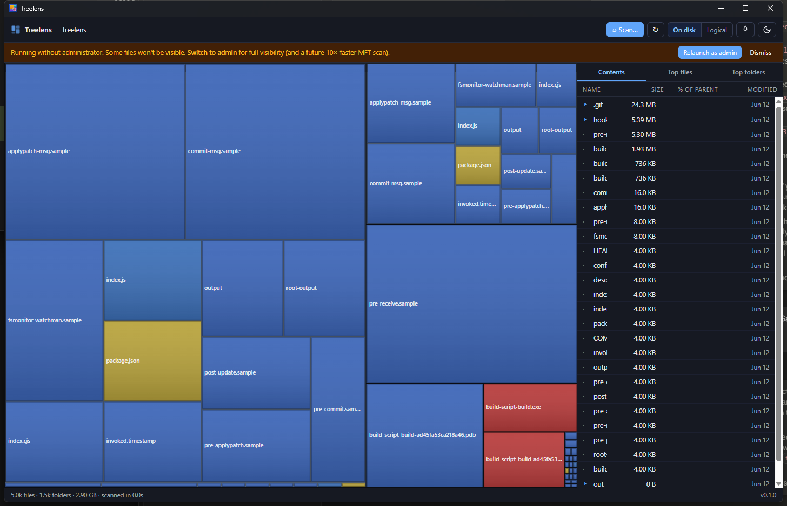

# Treelens

**A free, open-source, portable disk-space visualizer for Windows.**

> 
>
> A fast, modern, open-source disk-space visualizer — parallel scan, squarified treemap, dark/light theming, recycle-bin delete, MIT-licensed, no telemetry, no installer required.

## Download

Grab the latest portable EXE from [Releases](https://github.com/skyflyt/treelens/releases). Double-click — no installer needed.

| Asset | Description |
| --- | --- |
| `Treelens-x.y.z-portable.exe` | Single-file portable build. Drop on a USB stick and go. |
| `Treelens-x.y.z-setup.exe` | NSIS installer with Start-menu shortcut + uninstaller. |
| `SHA256SUMS.txt` | Verify your download. |

## What v0.1 ships

- **Scan** any folder or drive — parallel directory walk, works without admin and on any filesystem (NTFS / exFAT / ReFS / network shares).
- **Squarified treemap** with file-type coloring, depth-tinted directory headers, hover + click + drill-in.
- **Age-heat mode** — overlay modification age on the treemap (warm = recently changed, cold = old). One-click toggle.
- **Side panel** with three views: folder contents, top-50 files, top-50 folders. Sortable. Inline % bars, modified date, file count. **Virtualized** — drills all the way down to the individual file, smooth even in folders with tens of thousands of entries.
- **Breadcrumb** drill-up; <kbd>Backspace</kbd> as a keyboard shortcut.
- **Size mode toggle** — "size on disk" (allocated) by default, with a one-click flip to logical bytes.
- **Tabs** — multiple independent scans open at once, each with its own tree and drill state. New-tab button, click to switch, close to free it.
- **World-class keyboard navigation** — ↑/↓ move, → expand/step-in, ← collapse/parent, <kbd>Enter</kbd> drill/open, <kbd>Home</kbd>/<kbd>End</kbd>, PageUp/Down, and type-ahead to jump to a name.
- **Inspect panel** — for any file: CRC32/MD5/SHA-1/SHA-256 checksums, a steganography scan, file comparison, and extract/embed actions.
- **Steganography toolkit (detect · reverse · embed)** — find and recover data hidden in your own files by LSB (images), whitespace/SNOW (text), or appended-after-EOF (format-based); extract it to a file; or embed/watermark a copy for testing. A local, offline forensic tool — nothing leaves your machine.
- **A real file explorer with size superpowers:**
  - **Create** new folders and files (toolbar `＋ Folder` / `＋ File`, or right-click a folder).
  - **Rename** (<kbd>F2</kbd> or right-click), **open/edit** files in their default app (<kbd>Enter</kbd> / double-click), **delete to Recycle Bin** (<kbd>Delete</kbd>, via Shell `IFileOperation` — undo-able from Explorer).
  - "Open in Explorer" / "Open in Terminal" / "Copy full path".
  - "Find files older than 1 year (≥10 MB)" and "Find empty folders" under any subtree.
- **Admin banner** — runs without admin (some files hidden) and offers a one-click elevated relaunch for full visibility. File operations work identically in both modes.
- **Light + dark theme** following OS by default; manual override is persisted.

## Why

Finding what's eating your disk on Windows used to be a one-click answer with simple desktop tools. The free options have aged unevenly — single-threaded scanners that take twenty minutes on modern NVMe, closed-source binaries with restrictive personal-use-only licenses, abandoned projects, and tools that limit what they'll show you without an upgrade.

Treelens is the answer I wanted: a parallel scanner, a visual treemap, a familiar columnar drill-down, free forever, open source, MIT, no installer required.

## Roadmap

| Tier | Feature |
| --- | --- |
| ✅ v0.2 | File explorer ops (create / rename / open / recycle), virtualized tree to file level |
| ✅ v0.3 | Tabs, keyboard navigation, checksums, file compare, steganography (detect/extract/embed) |
| v0.4 | NTFS MFT fast path (FSCTL_ENUM_USN_DATA) for the 10× scan speedup |
| v0.4 | Truly portable `treelens.config.json` next to the exe |
| v0.x | Search / filter, CSV/JSON export, exclude patterns, multi-drive overview |
| v1.x | Scan history / snapshots, "what changed since last scan" diff |
| v2.x | Duplicate finder (size-prefilter → hash) |

Full plan: [PLAN.md](PLAN.md).

## A note on Windows warnings

Release binaries are currently **unsigned** (no Authenticode certificate yet), so SmartScreen may show "Windows protected your PC" and the UAC prompt will say "Publisher: Unknown."
Click _More info → Run anyway._ Source is right here; `SHA256SUMS.txt` lets you verify the bits.

## Build from source

```powershell
# Prerequisites: Rust (stable, MSVC toolchain) + Node 20+ + Windows 10/11 with WebView2
git clone https://github.com/skyflyt/treelens.git
cd treelens
npm install
npx tauri build
```

The portable EXE lands at `target/release/treelens.exe`.

## License

[MIT](LICENSE) © 2026 Skylar Pearce.

## No secrets — ever

This repository is public and **contains no credentials, API keys, or tokens, and never will**. Treelens is a fully client-side desktop app: there is no server component, no telemetry, and nothing a secret could legitimately do here. This is a strict, permanent rule for this repo — enforced in [AGENTS.md](AGENTS.md), defensively in [.gitignore](.gitignore), and by `gitleaks` in CI.
